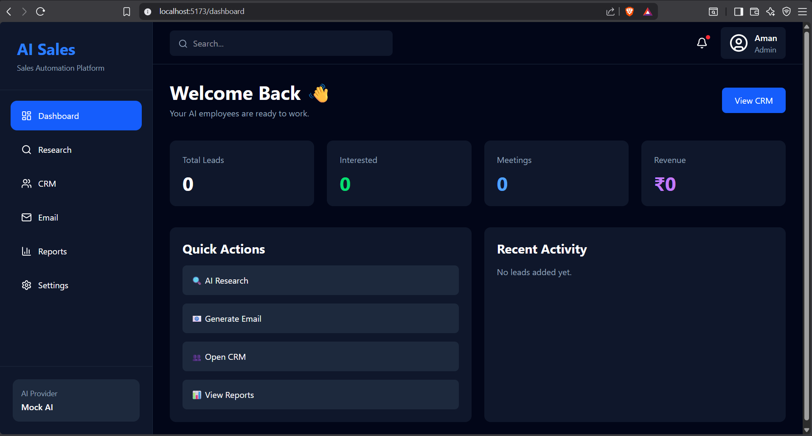
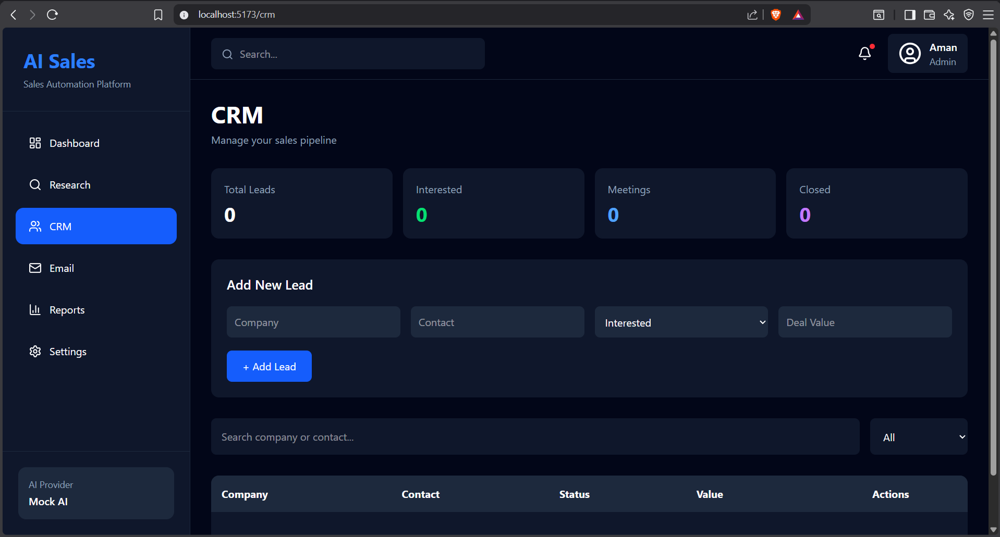
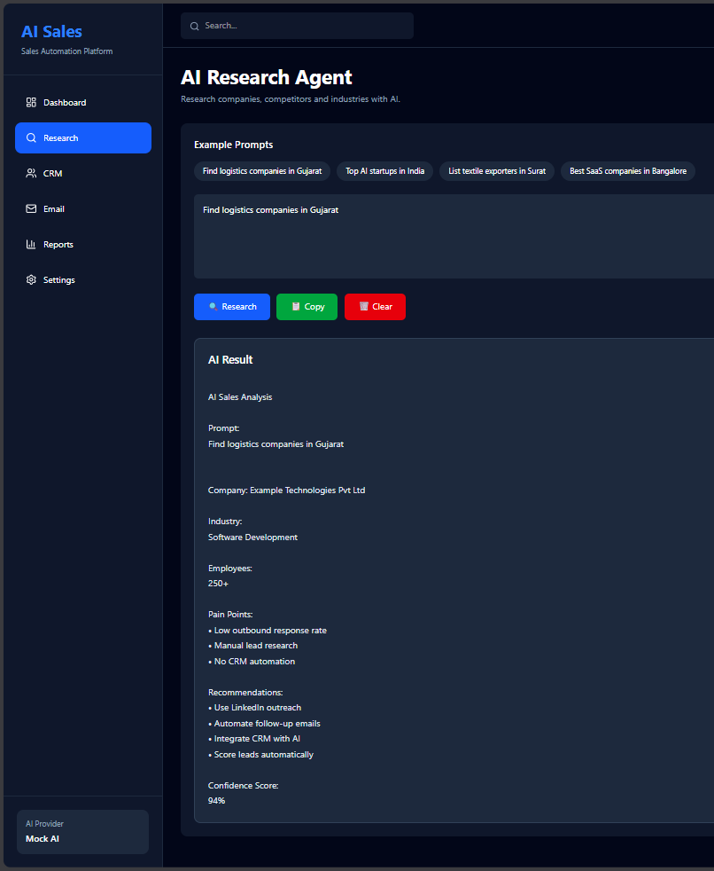
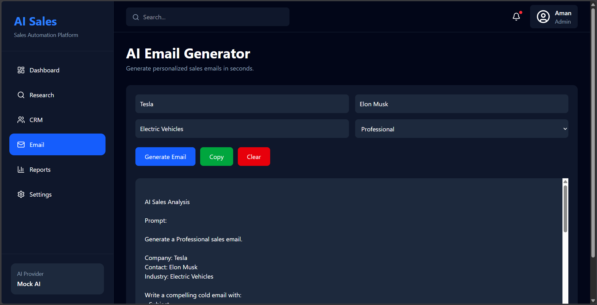
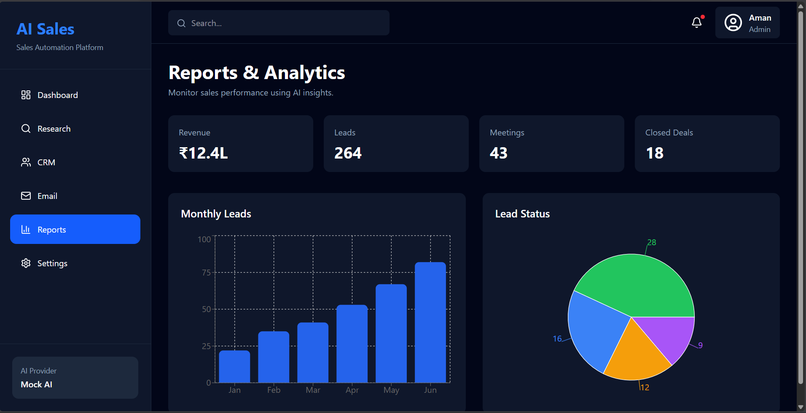
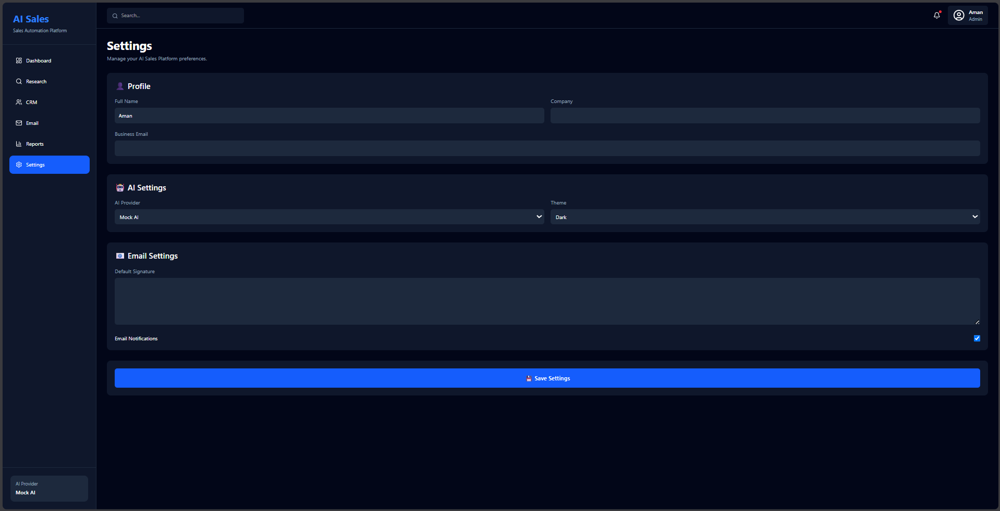

# AI Sales Platform

A production-oriented AI sales CRM with a React/Vite frontend, Express/TypeScript API, PostgreSQL, Prisma, secure JWT sessions, database-backed analytics, and optional DeepSeek generation.

The existing dark dashboard experience is preserved while its former local-only data layer is replaced with an authenticated multi-user backend.

## Capabilities

- Email-verified registration, login/logout, password reset, backup-code recovery, short-lived JWT access tokens, and replay-safe rotating HTTP-only refresh sessions
- Per-user CRM lead creation, editing, deletion, indexed search, cursor pagination, status tracking, and deal values
- Live dashboard and six-month reports aggregated in PostgreSQL without loading entire customer datasets
- Database-backed profile, company, email, notification, theme, and AI-provider settings
- Validated AI research and sales-email APIs with mock and optional DeepSeek providers
- Request IDs, structured/redacted logs, Helmet headers, CORS policy, body limits, and Redis-backed distributed rate limits
- Liveness plus PostgreSQL/Redis readiness probes, authenticated Prometheus metrics, and alert rules
- Unit, integration, and Chromium/Firefox/WebKit end-to-end tests with enforced coverage floors
- Strict TypeScript, ESLint, dependency auditing, hardened Docker/Compose, pinned GitHub Actions, and Render configuration

## Architecture

```text
React + Vite UI
      | HTTPS /api
Express 5 + TypeScript
      |-- JWT auth + refresh sessions + transactional email
      |-- CRM / reports / settings
      `-- AI provider adapter
              |-- Prisma 7 + PostgreSQL
              `-- Redis rate limits and AI budget guard
```

Express serves the compiled Vite app in production, so browser authentication stays same-origin. In development, Vite proxies `/api` to the server on port `4000`.

## Local development

Requirements: Node.js 22.12–24, npm, PostgreSQL 17+, Redis 8+, and Docker for the complete local stack.

1. Install dependencies.

   ```bash
   npm ci
   ```

2. Copy `.env.example` to an untracked `.env`. Replace the database password, JWT secrets, and metrics token. Keep development email delivery in `log` mode, or use the Compose Mailpit SMTP service.

3. Start PostgreSQL and Redis, if needed.

   ```bash
   docker compose up -d postgres redis
   ```

4. Apply migrations and start both development servers.

   ```bash
   npm run db:deploy
   npm run dev
   ```

Open `http://localhost:5173`. The API listens on `http://localhost:4000`.

To run the complete production-like stack instead:

```bash
docker compose up --build
```

Then open `http://localhost:4000`.
Mailpit's development inbox is available only on localhost at `http://localhost:8025`.

## Environment

All supported variables are documented in `.env.example`. Important production values are:

- `DATABASE_URL`: pooled PostgreSQL connection string used by the running application
- `DIRECT_URL`: optional direct PostgreSQL connection for migrations and backups; required for Neon production
- `REDIS_URL`: Redis/Upstash connection string; mandatory in production and TLS-enforced for Upstash
- `JWT_ACCESS_SECRET` and `JWT_REFRESH_SECRET`: independent high-entropy secrets
- `CORS_ORIGINS`: comma-separated additional browser origins; same-origin traffic is always accepted
- `TRUST_PROXY`: set to `1` behind a single trusted reverse proxy such as Render
- `APP_BASE_URL`, `EMAIL_FROM`, and either `RESEND_API_KEY` or `SMTP_*`: verified-account email delivery
- `METRICS_AUTH_TOKEN`: bearer credential for `/api/metrics`
- `DEEPSEEK_API_KEY` and a positive `AI_MONTHLY_REQUEST_LIMIT`: optional and both required before a user can select DeepSeek
- `SERVE_STATIC`: set to `true` when Express should serve the built frontend

Never commit `.env` files. The repository ignores every `.env*` file except `.env.example`.

## Commands

| Command | Purpose |
| --- | --- |
| `npm run dev` | Start Vite and the API in watch mode |
| `npm run build` | Generate Prisma Client, type-check, and build frontend/server |
| `npm run typecheck` | Type-check frontend and server |
| `npm run lint` | Lint all authored TypeScript |
| `npm test` | Run the backend and browser test suites |
| `npm run test:coverage` | Run all tests with enforced coverage floors |
| `npm run test:e2e` | Run the account lifecycle in Chromium, Firefox, and WebKit |
| `npm run api:lint` | Validate the OpenAPI 3.1 contract |
| `npm run deploy:lint` | Validate both Render Blueprints and enforce the zero-cost resource boundary |
| `npm run prisma:validate` | Validate the Prisma schema |
| `npm run db:migrate` | Create/apply a development migration |
| `npm run db:deploy` | Apply committed migrations in CI/production |
| `npm run db:backup` | Create and verify a custom-format PostgreSQL backup |
| `npm run db:restore` | Restore a backup after exact-target confirmation |
| `npm start` | Start the compiled production server |

## API surface

Public endpoints:

- `GET /api/health/live`
- `GET /api/health/ready`
- `POST /api/auth/register`
- `POST /api/auth/verification/request`
- `POST /api/auth/verify-email`
- `POST /api/auth/login`
- `POST /api/auth/refresh`
- `POST /api/auth/logout`
- `POST /api/auth/password-reset/request`
- `POST /api/auth/password-reset/confirm`
- `POST /api/auth/recover`
- `POST /api/ai/demo` (mock-only and rate-limited)

Bearer-token protected endpoints:

- `GET /api/auth/me`
- `POST /api/auth/recovery-codes`
- `GET|POST /api/leads` (`GET` supports `search`, `status`, `limit`, and `cursor`)
- `PUT|DELETE /api/leads/:id`
- `GET|PUT /api/settings`
- `GET /api/reports/summary`
- `POST /api/ai/research`
- `POST /api/ai/email`

Errors use a consistent `{ "error": { "code", "message", "requestId" } }` envelope. Successful responses use `{ "data": ... }`.
The complete machine-readable contract is [`docs/openapi.yaml`](docs/openapi.yaml).

## Deployment

The default [`render.yaml`](render.yaml) creates exactly one Render Free web service and uses external Neon Free PostgreSQL, Upstash Redis Free, and Resend Free. It intentionally creates no paid Render datastore, disk, worker, cron job, or paid service. Because Render Free does not support pre-deploy commands, its startup command applies committed Prisma migrations before starting the server. The original production-grade paid topology is preserved as [`render.production.yaml`](render.production.yaml) and must not be deployed under the ₹250/month budget.

For the zero-cost early launch:

1. Follow [`docs/FREE_TIER_DEPLOYMENT.md`](docs/FREE_TIER_DEPLOYMENT.md) exactly and keep every provider on its named Free plan.
2. Do not add payment methods; this makes provider quota exhaustion fail closed instead of producing usage charges.
3. Enter Neon, Upstash, and Resend credentials directly in their respective dashboards—never in chat or GitHub.
4. Deploy only after CI passes, then verify email lifecycle, CRM persistence, Redis rate limiting, and Mock AI from the public URL.

GitHub Actions validates migrations, lint, types, tests, production builds, dependency security, and the Docker image on feature pushes and pull requests.

Operational checks and rollback guidance are documented in [`docs/OPERATIONS.md`](docs/OPERATIONS.md). Monitoring and recovery runbooks are in [`docs/MONITORING.md`](docs/MONITORING.md) and [`docs/DISASTER_RECOVERY.md`](docs/DISASTER_RECOVERY.md).

## Screenshots

| Dashboard | CRM |
| --- | --- |
|  |  |

| AI Research | Email Generator |
| --- | --- |
|  |  |

| Reports | Settings |
| --- | --- |
|  |  |

## License

MIT License. See `LICENSE`.
